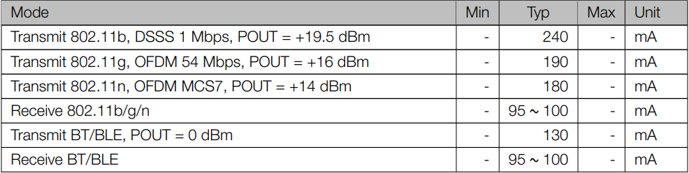
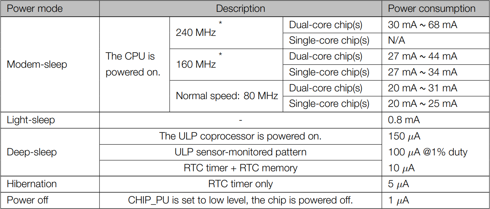
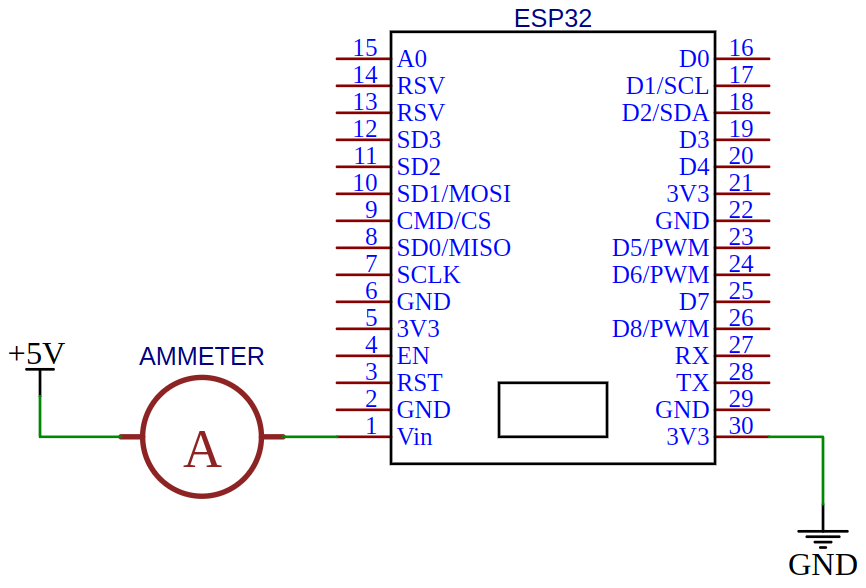

## ¿Que está contribuyendo al consumo total de tu plataforma y de qué manera?

Lo primero que se hace es ir al datasheet del fabricante para obtener los consumos promedios de los distintos periféricos del micro. Del datasheet se extrajo la siguiente información.

### Consumo en modo activo



### Consumo en otros modos



Estos valores son solo para el micro, no para la placa de desarrollo, por lo cual es de esperarse que el consumo obtenido de las mediciones sea mayor. Es importante destacar que la placa hace uso de un regulador AMS1117 que consume 5mA en standby.

Para averiguar el consumo de la placa realizaremos pruebas de los distintos modos. Las mediciones se harán con un miliamperímetro conectado de la siguiente manera.



El código de prueba es una función vacía, lo único que se hace es setear el modo de funcionamiento deseado.

```
  // Modem sleep
  esp_wifi_set_ps(WIFI_PS_MIN_MODEM);

  // Light sleep
  esp_light_sleep_start();

  // Deep sleep
  esp_deep_sleep_start();

  // Hibernation
  esp_sleep_pd_config(ESP_PD_DOMAIN_RTC_SLOW_MEM, ESP_PD_OPTION_OFF); // Disable RTC IO, sensors and ULP co-processor
  esp_sleep_pd_config(ESP_PD_DOMAIN_RTC_FAST_MEM, ESP_PD_OPTION_OFF); // Disable RTC slow memory.
  esp_sleep_pd_config(ESP_PD_DOMAIN_RTC_PERIPH, ESP_PD_OPTION_OFF);   // Disable RTC fast memory
  esp_deep_sleep_start();
}
```

La siguiente tabla resume los resultados obtenidos.

| Power mode           | Power consumption |
| -------------------- | ----------------- |
| Modem-sleep (160Mhz) | 36.8 mA           |
| Light-sleep          | 12.08 mA          |
| Deep-sleep           | 10.91 mA          |
| Hibernation          | 10.91 mA          |

Podemos ver que al aumentar el modo de sleep el consumo es menor, sin embargo los valores son mayores a los del datasheet, por lo que se comentó anteriormente.

## Documentación:

[Datasheet](https://espressif.com/sites/default/files/documentation/esp32_datasheet_en.pdf)

[Sleep modes](https://docs.espressif.com/projects/esp-idf/en/latest/esp32/api-reference/system/sleep_modes.html)

[Tutorial](https://diyi0t.com/reduce-the-esp32-power-consumption/)

## Placa utilizada

ESP32­WROOM­32E basado en ESP32-D0WD
