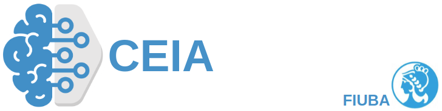

# Procesamiento de Lenguaje Natural

En este repositorio se encuentran todos los desafios que se hicieron durante el cursado de la cátedra Procesamiento de Lenguaje Natural para el Curso de Especialización en Inteligencia Artificial (CEIA)

Los trabajos son los siguientes:

- [Clase 1](https://github.com/achurichi/CEIA/tree/main/nlp/clase-1): En este notebook se verá como utilizar word2vect.
- [Clase 2](https://github.com/achurichi/CEIA/tree/main/nlp/clase-2): En este notebook se realizará un Rule-Based BOT utilizando la librería SpaCy.
- [Clase 3](https://github.com/achurichi/CEIA/tree/main/nlp/clase-3): En este notebook se utilizará Gensim para crear nuestros propios embeddings.
- [Clase 4](https://github.com/achurichi/CEIA/blob/main/nlp/clase-4): El objetivo de este trabajo es desarrollar un modelo de NLP capaz de predecir la proxima palabra dada una secuencia de texto.
- [Clase 5](https://github.com/achurichi/CEIA/blob/main/nlp/clase-5): Entrenaremos una red neuronal que, dada una entrada de texto sea capaz de predecír la calificación que se le asignará al producto.
- [Clase 6](https://github.com/achurichi/CEIA/blob/main/nlp/clase-6): Se utilizará un dataset de conversaciones en ingles con el objetivo de entrenar un bot conversacional.
